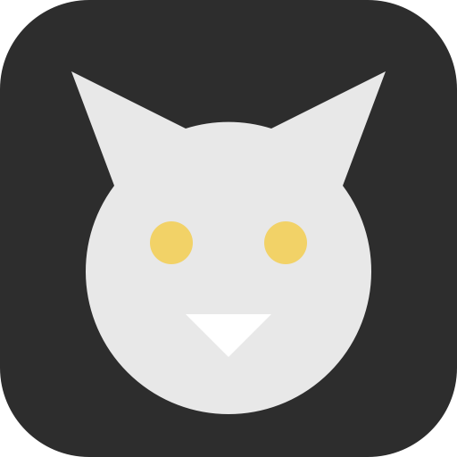

# 🐱 Cat Desktop Pet

This is a tiny desktop companion that lives on your macOS or Windows screen. It follows your mouse movement by default and supports a range of action animations. Built with Electron and sprite-based rendering, it is well suited for desktop widgets, personal showcases, or further customization.



## Quick Start

### macOS

1. Download the macOS package: `dist/Cat Desktop Pet-1.0.0-mac-arm64.dmg` for Apple Silicon or `dist/Cat Desktop Pet-1.0.0-mac-x64.dmg` for Intel
2. Open the DMG and drag the app into Applications
3. On first launch, right-click the app and choose "Open" to bypass Gatekeeper restrictions

### Windows

1. Download `dist/Cat Desktop Pet-1.0.0-win-x64.zip`
2. Extract it to any folder
3. Double-click `Cat Desktop Pet.exe` to launch it

### Development Environment

```bash
# Requirements: Node.js >= 18
git clone https://github.com/chen5544/mypet.git
cd mypet
npm install

# Start the desktop pet (Electron)
npm start

# Preview the tracking behavior in the browser (Vite)
npm run preview
```

## Features

| Action | Description |
|---|---|
| 🎯 **Follow** | Default mode; the cat turns its head to follow the mouse direction |
| 🏃 **Run** | The window moves horizontally at 200px/s, reverses at screen edges, and fades out smoothly |
| 🍽️ **Eat** | In-place animation, scaled down to 60% |
| 🎾 **Play** | In-place animation, looping at 28fps |
| 🦘 **Jump** | In-place animation, played at 56fps (2x speed) |
| 😴 **Sleep** | In-place animation, scaled down to 75% |
| 🧼 **Wash** | In-place animation, scaled proportionally to 70% |
| 🚶 **Walk** | The window moves horizontally at 115px/s, reverses at screen edges, and fades out smoothly |

### Interaction

- Hover over the cat to reveal action buttons around it
- Click a button to switch actions
- Right-click to bring up the action menu manually
- Click the cat while it is walking or running to return to follow mode
- The tray menu supports locking with mouse passthrough, unlocking, moving the pet back to the bottom-right corner, and quitting

### Lock Mode

The tray menu option "Lock and Mouse Passthrough" keeps the cat fixed on the desktop while allowing mouse events to pass through to the windows behind it, which is ideal for long-term use.

## Asset Production

The sprite sheets in this project are generated automatically from green-screen videos.

```bash
# Process the main tracking video
npm run process:video "/path/to/video.mp4"

# Process action videos
npm run process:run       # Run
npm run process:eat       # Eat
npm run process:play      # Play
npm run process:jump      # Jump
npm run process:sleep     # Sleep
npm run process:walk-left # Walk left
npm run process:wash      # Wash

# Rightward walk/run assets are generated by mirroring the left-side source

# Validate all assets
npm run validate
```

### Chroma Key Parameters

The matting thresholds are defined in `scripts/process-video.mjs` and `scripts/process-run-video.mjs`:

- Base color: `[56, 166, 35]`
- Uses color distance, green dominance, and shadow-channel detection
- Supports green spill suppression and repair of internal transparent holes

After changing these values, rerun the corresponding `process:*` command and then run `npm run validate`.

## Angle Calibration

The mapping between head angle and frame index is stored in `src/angle-config.js` under `ANGLE_ANCHORS`. If the cat's response to the mouse direction feels off, adjust the anchors and then run:

```bash
npm run validate
npm start
```

## Project Structure

```text
src/
  main.js           → Electron main process (window, tray, cursor polling, walking engine)
  preload.cjs       → contextBridge API
  renderer.js       → Render loop, sprite-frame interpolation, and action state machine
  angle-config.js   → Angle anchors, frame mapping, and shared constants
  styles.css        → Transparent window styling and action menu
scripts/
  process-video.mjs    → Green-screen matting and sprite packing for the tracking video
  process-run-video.mjs → Action-video processing, including padToSquare and Lanczos-3 scaling
  validate-assets.mjs  → Validation for frame count, size, alpha, and angle continuity
public/assets/sprites/ → Runtime sprite sheets (13×N grid PNG files)
```

## Build Packages

```bash
npm run dist:mac   # macOS DMG + ZIP
npm run dist:win   # Windows ZIP (portable)
npm run dist:all   # All platforms
```

The build output will be written to the `dist/` directory.

## Technical Highlights

- **Lanczos-3 scaling**: Preserves more high-frequency detail than bilinear interpolation
- **padToSquare**: Pads portrait footage with transparent pixels to make it square before scaling, keeping the pet proportionally correct
- **Edge fade-out**: Smoothly fades out near screen edges and fades back in after turning around
- **Green-screen matting**: Combines color distance, green dominance, shadow-channel detection, and edge feathering

## Replace It with Your Own Pet (Free)

If you want to turn this desktop pet into your own pet, the workflow is quite simple:

1. Take a full-body photo of your pet in even lighting
2. Remove the background and replace it with a green screen to create a base asset (you can use ChatGPT to remove the background for free)
3. Use that base asset to generate prompts for the actions you want, such as standing, walking, eating, and playing
4. Feed those prompts into a video generation model to produce roughly 7 seconds of green-screen action footage (Doubao often offers free, non-queued access to Seedance 2)
5. Open this project with Claude Code, Codex, or similar tools and replace the corresponding sprite-generation assets. You can even use DeepSeek for this, which is essentially free.

For users in China, Seedance from Dreamina is a solid option, and Doubao often provides free usage quotas.
